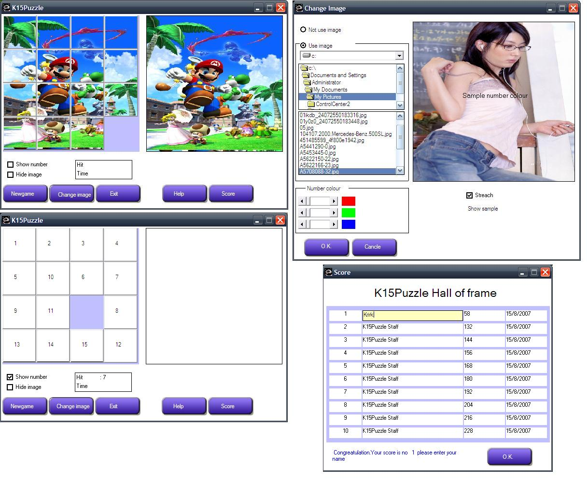



## K15Puzzle

### Description

15 Puzzle game

This game is simple,It is not use ocx and not register any component.

not use directX.

A button you see in a picture,I just use picturebox and label,cause I want you easy to run.

You just download unziped and feel free to play a game.

It is not just game to write by vb,but i want player have fun too.

If you like it you just vote for me :D

Feature

1.Can change image.

2.Image can stretch.

3.Can use number only or use image and number.
 
### More Info
 

             |
---                |---
**Submitted On**   |2007-08-19 23:34:22
**By**             |[Krirk Srithaweewath](https://github.com/Planet-Source-Code/PSCIndex/blob/master/ByAuthor/krirk-srithaweewath.md)
**Level**          |Intermediate
**User Rating**    |4.9 (44 globes from 9 users)
**Compatibility**  |VB 4\.0 \(32\-bit\), VB 5\.0, VB 6\.0
**Category**       |[Complete Applications](https://github.com/Planet-Source-Code/PSCIndex/blob/master/ByCategory/complete-applications__1-27.md)
**World**          |[Visual Basic](https://github.com/Planet-Source-Code/PSCIndex/blob/master/ByWorld/visual-basic.md)
**Archive File**   |[K15Puzzle2082839112007\.zip](https://github.com/Planet-Source-Code/krirk-srithaweewath-k15puzzle__1-69308/archive/master.zip)

